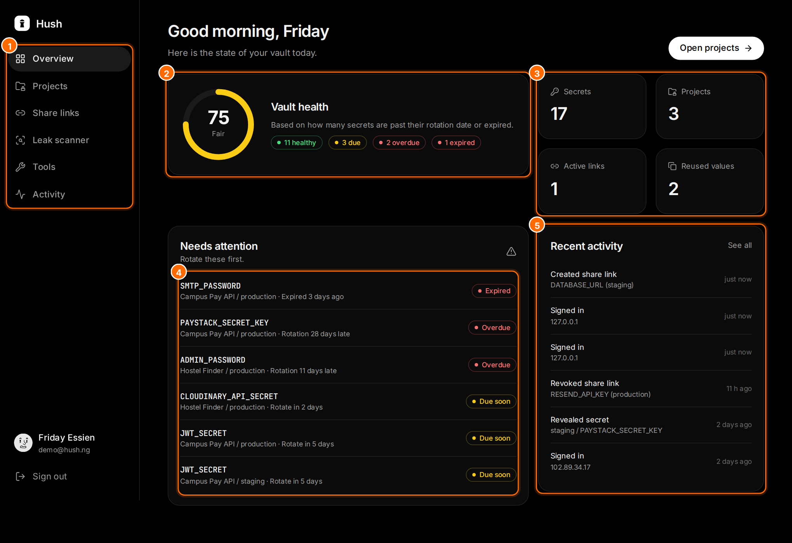

# Hush

A simple env manager and vault for project secrets. Hush keeps your development, staging and production variables encrypted, tells you which keys are due for rotation, and lets you share a secret with a link that works once.

**Live:** https://hush-production-70be.up.railway.app
**Demo login:** `demo@hush.ng` / `demo1234` (pre-filled on the sign-in page)



## Features

- **Encrypted vault.** Projects with development, staging and production variables, encrypted with AES-256-GCM. Each value is bound to its project, environment and key name, so a copied ciphertext cannot be decrypted in another row.
- **Rotation tracking.** Rotation periods and expiry dates. Every secret is healthy, due soon, overdue or expired, and the vault gets a health score.
- **Reuse detection.** Flags the same value stored in more than one place without comparing plaintext.
- **.env import and export.** Paste a .env file (bad lines are reported with line numbers) or download an environment.
- **One-time share links.** Links expire and stop working after a set number of views. Only a hash of the link is stored.
- **Leak scanner.** Finds API keys, tokens, private keys and passwords in pasted code. Runs in the browser.
- **Image scrambler.** Scrambles an image with a key; the same key restores it exactly.
- **File sealing.** Encrypts any file with a passphrase in the browser (PBKDF2 and AES-GCM).
- **Secret generator** with an entropy estimate.
- **Activity log** of sign-ins, failed sign-ins, reveals, exports and shares, with lockout after 5 failed sign-ins in 15 minutes.

Full documentation with annotated screenshots: [docs/Hush-Documentation.pdf](docs/Hush-Documentation.pdf).

## Quick start

Requires Node.js 20.9+ and PostgreSQL.

```bash
service postgresql start
createdb hush
cp .env.example .env      # set DATABASE_URL and SESSION_SECRET
npm install
npm run db:migrate
npm run db:seed
npm run dev               # http://localhost:3000
```

Set `HUSH_TODAY=YYYY-MM-DD` in `.env` to pin the date for demos and tests.

## Scripts

| Script | What it does |
| --- | --- |
| `npm run dev` | Start the development server |
| `npm run build` / `npm start` | Build and serve for production |
| `npm run typecheck` / `npm run lint` | TypeScript and ESLint checks |
| `npm run db:generate` | Create a migration after changing `src/db/schema.ts` |
| `npm run db:migrate` | Apply migrations (creates the database if it is missing) |
| `npm run db:seed` | Reset and load demo data dated relative to today |
| `npm run db:seed:if-empty` | Seed only when there are no users (used on Railway) |
| `npm test` | Unit and integration tests (needs a `hush_test` database) |
| `npm run test:e2e` | Playwright tests on desktop and Pixel 7 (needs `npm run build` and a `hush_e2e` database) |
| `npm run docs` | Rebuild `docs/Hush-Documentation.pdf` (needs `npm run build` and a `hush_docs` database) |

## Tests

| Suite | Tests |
| --- | --- |
| Unit (Vitest) | 61 |
| Integration (Vitest, real PostgreSQL) | 18 |
| End-to-end desktop (Playwright) | 17 |
| End-to-end mobile (Playwright, Pixel 7) | 2 |
| **Total** | **98** |

## Stack

Next.js 16 (App Router, Server Components, Server Actions), React 19, TypeScript (strict), Drizzle ORM with PostgreSQL, Zod, bcryptjs, jose, lucide-react, DiceBear, Fontsource, Vitest and Playwright. Deployed on Railway with `railway.json`: build with `npm run build`; start runs migrations, seeds only an empty database, then `next start -H 0.0.0.0`; health check at `/api/health`.

## Project layout

```
src/lib        pure business rules (crypto, rotation, envfile, scanner, scramble, seal, ...)
src/server     database services (vault, shares, users, audit, seed)
src/app        pages, Server Actions, /api/health and the .env export route
src/db         Drizzle schema
drizzle        SQL migrations
scripts        migrate, seed and the documentation builder
tests          unit, integration and e2e
```
